# Stellar-Save — Rotational Savings on Stellar

[](https://codecov.io/gh/Xoulomon/Stellar-Save)
[](https://github.com/Xoulomon/Stellar-Save/actions/workflows/coverage.yml)
[](https://codecov.io/gh/Xoulomon/Stellar-Save?flags[0]=frontend)
[](https://codecov.io/gh/Xoulomon/Stellar-Save?flags[0]=contracts)
[](https://codecov.io/gh/Xoulomon/Stellar-Save?flags[0]=backend)

**A decentralized rotational savings and credit association (ROSCA) built on Stellar Soroban smart contracts.**

Stellar Save is a traditional community-based savings system where members contribute a fixed amount regularly, and each member receives the total pool on a rotating basis. This project brings this time-tested financial mechanism to the blockchain, making it transparent, trustless, and accessible globally.

## 🎯 What is Stellar-Save?

Stellar-Save is a rotating savings and credit association (ROSCA) common in Nigeria and across Africa. Members:
- Form a group with a fixed contribution amount
- Contribute the same amount each cycle (e.g., weekly or monthly)
- Take turns receiving the full pool of contributions
- Build trust and financial discipline within communities

**This Soroban implementation makes Stellar-Save:**
- ✅ Trustless (no central coordinator needed)
- ✅ Transparent (all transactions on-chain)
- ✅ Accessible (anyone with a Stellar wallet can join)
- ✅ Programmable (automated payouts, no manual coordination)

## 🏗️ Architecture

The Stellar-Save system consists of four main layers that work together to provide a decentralized ROSCA experience:



### Architecture Components

- **User Layer**: Users interact with the system through Stellar wallets (Freighter, Lobstr, Albedo)
- **Frontend Layer**: React + TypeScript SPA with Vite, Material-UI components, and React Query for state management
- **Blockchain Layer**: Stellar network with Soroban smart contracts managing groups, contributions, and payouts
- **Data Layer**: On-chain storage, Stellar Horizon API for transaction history, and Soroban events for real-time updates

### Key Data Flows

1. **Group Creation**: User → Frontend → Contract → On-chain Storage → Events → UI Update
2. **Contribution**: User → Frontend → Contract → Escrow → Storage → Events → UI Update
3. **Payout**: User → Frontend → Contract → Escrow → Recipient → Storage → Events → UI Update

For detailed architecture documentation, see [docs/architecture.md](docs/architecture.md).

## 🚀 Features

- **Create Groups**: Set contribution amount, cycle duration, and max members
- **Join & Participate**: Members join and contribute each cycle
- **Automatic Payouts**: When all members contribute, payout executes automatically to the next recipient
- **Native XLM Support**: Built-in support for Stellar Lumens (XLM)
- **Token Ready**: Architecture supports custom Stellar tokens (roadmap item)
- **Transparent**: All contributions and payouts are verifiable on-chain

## 🛠️ Quick Start & Workspace Guides

To get started quickly, follow the dedicated setup guides for each component of the Stellar-Save monorepo:

- 🚀 **Smart Contracts**: See [contracts/stellar-save/src/lib.rs](contracts/stellar-save/src/lib.rs) and the [QUICK_REFERENCE.md](QUICK_REFERENCE.md) for smart contract API documentation.
- 💻 **Frontend Web App**: See [frontend/README.md](frontend/README.md) for React/TypeScript setup, environment configuration (`VITE_*`), MUI theme tokens, and local development commands.
- 📱 **Mobile Application**: See [mobile/README.md](mobile/README.md) for Expo React Native setup, iOS/Android emulator instructions, and mobile architecture.
- 🛠️ **Scripts & Tooling**: See [scripts/README.md](scripts/README.md) for build (`build.sh`), test (`test.sh`), and deployment (`deploy_testnet.sh`, `deploy_mainnet.sh`) scripts.
- ⚙️ **Backend Service**: See [backend/README.md](backend/README.md) for server setup, environment variables schema, and indexer configuration.

### Common Development Commands

```bash
# Clone the repository
git clone https://github.com/Xoulomon/Stellar-Save.git
cd Stellar-Save

# Install root dependencies & git hooks
npm install

# Build Soroban smart contracts
./scripts/build.sh

# Run all test suites across smart contracts and web frontend
./scripts/test.sh
```

### Run Demo

Follow the step-by-step guide in [demo/demo-script.md](demo/demo-script.md).

## 📖 Documentation

- [Local Development Setup](docs/local-development-setup.md) — clone-to-running-app guide for backend, frontend, contracts, and mobile
- [User Guide](docs/user-guide.md)
- [Architecture Overview](docs/architecture.md)
- [Public API Reference](docs/api/interactive-api-reference.md) — REST API with code examples
- [Interactive API Docs](https://api.stellar-save.app/docs) — Try API calls in your browser
- [Governance Process](docs/governance.md) — How protocol decisions are made on-chain
- [Storage Layout](docs/storage-layout.md)
- [Threat Model & Security](docs/threat-model.md)
- [Performance Optimization Guide](docs/performance-optimization.md)
- [Roadmap](docs/roadmap.md)
- [Frequently Asked Questions (FAQ)](docs/faq.md)
- [Mobile App User Guide](docs/mobile-app-guide.md)
- [Mobile App Developer & Contributor Guide](docs/mobile-app-developer-guide.md)
- [Troubleshooting Guide](docs/troubleshooting.md)
- [Synthetic Monitoring / Uptime Canaries](docs/synthetic-monitoring.md)
- [Observability Guide](docs/observability.md)
- [Funnel & Cohort Analytics](docs/funnel-analytics.md)
- [Design Token System](docs/design-tokens.md)
- [ZK Verification](docs/zk-verification.md)
- [Security Guide](docs/security-guide.md)

## 🎓 Smart Contract API

### Group Management
```rust
create_group(contribution_amount, cycle_duration, max_members) -> u64
get_group(group_id) -> Group
list_members(group_id) -> Vec<Address>
```

### Membership
```rust
join_group(group_id)
is_member(group_id, address) -> bool
```

### Contributions
```rust
contribute(group_id, member, amount)
get_contribution_status(group_id, cycle_number) -> Vec<(Address, bool)>
```

### Payouts
```rust
execute_payout(group_id)
is_complete(group_id) -> bool
```

### Emergency Pause
```rust
pause_group(group_id, caller)    // Creator-only: halt contributions & payouts
unpause_group(group_id, caller)  // Creator-only: resume contributions & payouts
```

## 🧪 Testing

Comprehensive test suite covering:
- ✅ Group creation and configuration
- ✅ Member joining and validation
- ✅ Contribution flow and tracking
- ✅ Payout rotation and distribution
- ✅ Group completion lifecycle
- ✅ Emergency pause/unpause scenarios
- ✅ Error handling and edge cases

Run tests:
```bash
cargo test
```

### Test Coverage

Coverage is tracked and enforced per workspace and published to
[Codecov](https://codecov.io/gh/Xoulomon/Stellar-Save), which provides public
reports and historical trends.

| Workspace  | Tool             | Minimum coverage gate |
|------------|------------------|-----------------------|
| frontend   | vitest (v8)      | 80% lines / 70% branches |
| contracts  | cargo-tarpaulin  | 85% lines |
| backend    | jest (ts-jest)   | 60% lines |

PRs **cannot merge** if coverage falls below these targets or drops versus the
base commit: the `coverage.yml` workflow uploads results to Codecov on every
push and pull request, and the Codecov project/patch status checks (configured
in [`codecov.yml`](./codecov.yml)) act as required PR merge gates. The same
thresholds also fail CI locally via per-tool gates (tarpaulin `fail-under`,
vitest `coverage.thresholds`, jest `coverageThreshold`).

Run coverage locally:
```bash
# contracts
cargo tarpaulin --config tarpaulin.toml
# frontend
cd frontend && npm run test:coverage
# backend
cd backend && npm run test:coverage
```

See [docs/test-coverage.md](docs/test-coverage.md) for full details.

## 🌍 Why This Matters

**Financial Inclusion**: Over 1.7 billion adults globally are unbanked. Ajo/Esusu has served African communities for generations as a trusted savings mechanism.

**Blockchain Benefits**:
- No need for a trusted coordinator
- Transparent contribution and payout history
- Programmable rules enforced by smart contracts
- Accessible to anyone with a Stellar wallet

**Target Users**:
- African diaspora communities
- Unbanked/underbanked populations
- Small business owners needing working capital
- Communities building financial discipline


## 🗺️ Roadmap

- **v1.0** (Current): XLM-only groups, basic functionality
- **v1.1**: Custom token support (USDC, EURC, etc.)
- **v2.0**: Flexible payout schedules, penalty mechanisms
- **v3.0**: Frontend UI with wallet integration
- **v4.0**: Mobile app, fiat on/off-ramps

See [docs/roadmap.md](docs/roadmap.md) for details.

## 🤝 Contributing

We welcome contributions! Please:
1. Fork the repository
2. Create a feature branch (`git checkout -b feature/amazing-feature`)
3. Commit your changes (`git commit -m 'Add amazing feature'`)
4. Push to the branch (`git push origin feature/amazing-feature`)
5. Open a Pull Request

See our [Code of Conduct](CODE_OF_CONDUCT.md) and [Contributing Guidelines](CONTRIBUTING.md).

### 🌊 Drips Wave Contributors

This project participates in **Drips Wave** - a contributor funding program! Check out:
- **[Wave Contributor Guide](docs/wave-guide.md)** - How to earn funding for contributions
- **[Wave-Ready Issues](docs/wave-ready-issues.md)** - 12 funded issues ready to tackle
- **GitHub Issues** labeled with `wave-ready` - Earn 100-200 points per issue

Issues are categorized as:
- `trivial` (100 points) - Documentation, simple tests, minor fixes
- `medium` (150 points) - Helper functions, validation logic, moderate features  
- `high` (200 points) - Core features, complex integrations, security enhancements

## 📄 License

This project is licensed under the MIT License - see the [LICENSE](LICENSE) file for details.

## 🙏 Acknowledgments

- Stellar Development Foundation for Soroban
- African communities that have practiced Ajo/Esusu for centuries
- Drips Wave for supporting public goods funding

## 📞 Contact

- **Issues**: [GitHub Issues](https://github.com/Xoulomon/Stellar-Save/issues)
- **Discussions**: [GitHub Discussions](https://github.com/Xoulomon/Stellar-Save/discussions)
- **Telegram**: [@Xoulomon]

---

**Built with ❤️ for financial inclusion on Stellar**
