# ADR-004: Contract Module Boundaries in `contracts/stellar-save/`

**Status**: Accepted
**Date**: 2026-07-29
**Author**: Stellar-Save Team
**Deciders**: Architecture & Contracts Team

## Context

`contracts/stellar-save/src/` has grown into ~30 Rust modules as the ROSCA contract picked up governance, penalties, ratings, milestones, and storage migrations on top of the original group/contribution/payout flow. There was no single document explaining why the crate is split the way it is, which made it hard for new contributors to know where a given piece of logic belongs.

Note: an earlier draft of this ADR's scope assumed the crate had separate `insurance` and `escrow` modules. Neither exists in the current codebase — this ADR documents the module boundaries as they actually are today.

## Decision

Split the crate by **domain responsibility**, not by technical layer, so each module owns one concern end-to-end (types + logic for that concern):

### Core lifecycle

- **`group.rs`** — `Group` struct, `GroupStatus`, membership data, and group-level invariants (max members, etc.). The central entity every other module reads.
- **`auth.rs`** — authorization checks (e.g. "is this address an active member") shared across modules that gate calls by membership/role.
- **`contribution.rs`** — contribution records and paginated history queries.
- **`pool.rs`** — pool-amount math for the current cycle (how much is collected, how much is available to pay out).
- **`cycle_advancement.rs`** — advances a group from one cycle to the next once conditions are met.
- **`deadline.rs`** — cycle deadline tracking and enforcement.

### Payout

- **`payout.rs`** — payout-order strategy (`PayoutOrder`) and recipient selection rules, stored on `Group`.
- **`payout_executor.rs`** — orchestrates the actual fund transfer once a cycle completes: verifies completion, resolves the recipient, and executes the transfer.

### Governance

- **`governance/`** — group-dissolution voting and dynamic contribution-amount changes, split into three sub-modules so each stays independently testable:
  - `proposal.rs` — creating a pending change
  - `voting.rs` — casting votes and checking thresholds
  - `execution.rs` — applying the resulting state change

### Member-facing mechanics

- **`penalty.rs`** — missed-contribution penalty schedule (5% per miss, capped at 25%).
- **`rating.rs`** — post-completion 1–5 star group ratings and aggregates.
- **`refund.rs`** — refund records when a group is cancelled or a member exits.
- **`milestones.rs`** — consecutive-contribution milestone tracking (5/10/20 cycles).

### Storage and migration

- **`storage.rs`** — `StorageKeyBuilder` and the storage schema version (`STORAGE_VERSION`), the single source of truth for how state is keyed.
- **`storage_benchmark.rs`** / **`storage_optimization.rs`** — measurement and layout-optimization helpers for storage, kept out of the hot path modules.
- **`migration.rs`** / **`migrations/`** — upgrades stored data between `STORAGE_VERSION`s.
- **`repository.rs`** — a repository-pattern abstraction over group-related `env.storage()` reads/writes, so storage access isn't duplicated across modules.

### Supporting modules

- **`search.rs`** — filtering/pagination queries over groups (status, contribution range, member count).
- **`token.rs`** — SEP-41 token-contract validation before a token is accepted for a group.
- **`events.rs`** — event emission (`EventEmitter`) used by state-changing modules to publish on-chain events.
- **`error.rs`** / **`errors.rs`** — shared error types (`StellarSaveError`) returned across the crate.
- **`status.rs`** — state-transition error types for invalid `GroupStatus` changes.
- **`types.rs`** — shared primitive/shared types with no other natural home.
- **`contract.rs`** — the `#[contract]` entry point that wires the public functions to the modules above.
- **`clone.rs`** — contract cloning/duplication support.

## Inter-Module Dependencies

```mermaid
flowchart TD
    contract["contract.rs (entry point)"]

    contract --> group
    contract --> payout_executor
    contract --> governance

    group["group.rs"]
    auth["auth.rs"] --> group
    contribution["contribution.rs"]
    pool["pool.rs"] --> storage
    pool --> error
    cycle_advancement["cycle_advancement.rs"] --> group
    cycle_advancement --> storage
    cycle_advancement --> events
    deadline["deadline.rs"] --> group
    deadline --> storage
    deadline --> events

    payout["payout.rs"] --> group
    payout --> storage
    payout_executor["payout_executor.rs"] --> payout
    payout_executor --> pool
    payout_executor --> group
    payout_executor --> storage

    governance["governance/ (proposal, voting, execution)"] --> group
    governance --> storage
    governance --> error

    penalty["penalty.rs"] --> group
    penalty --> storage
    rating["rating.rs"] --> storage
    refund["refund.rs"] --> contribution
    refund --> group
    refund --> storage
    refund --> events
    milestones["milestones.rs"] --> auth
    milestones --> storage
    milestones --> error

    migration["migration.rs / migrations/"] --> storage
    migration --> group
    migration --> status
    repository["repository.rs"] --> group
    repository --> error
    search["search.rs"] --> group

    storage["storage.rs"]
    events["events.rs"]
    error["error.rs / errors.rs"]
    status["status.rs"] --> error
```

Everything ultimately depends on `storage.rs` (how state is keyed) and `error.rs`/`errors.rs` (how failures are represented); `group.rs` is the shared entity almost every other module reads or mutates.

## Consequences

- **Positive**: a contributor adding a feature can find the right module by asking "which domain concern is this?" rather than "which layer?" — e.g. a new penalty rule goes in `penalty.rs`, not scattered across `contract.rs`.
- **Positive**: `governance/` shows the pattern for splitting a growing concern into sub-modules (proposal/voting/execution) instead of one large file — a template for future growth (e.g. if payout logic needs the same treatment).
- **Trade-off**: with ~30 modules, discoverability depends on this document and `contracts/stellar-save/QUICK_REFERENCE.md` staying current — there's no compiler-enforced boundary preventing a new module from reaching into another's internals.

## Related

- [contracts/stellar-save/QUICK_REFERENCE.md](../../contracts/stellar-save/QUICK_REFERENCE.md)
- [ADR-001: Soroban Platform Choice](./ADR-001-soroban-platform-choice.md)
- [ADR-003: Event Indexing Approach](./ADR-003-event-indexing-approach.md)
